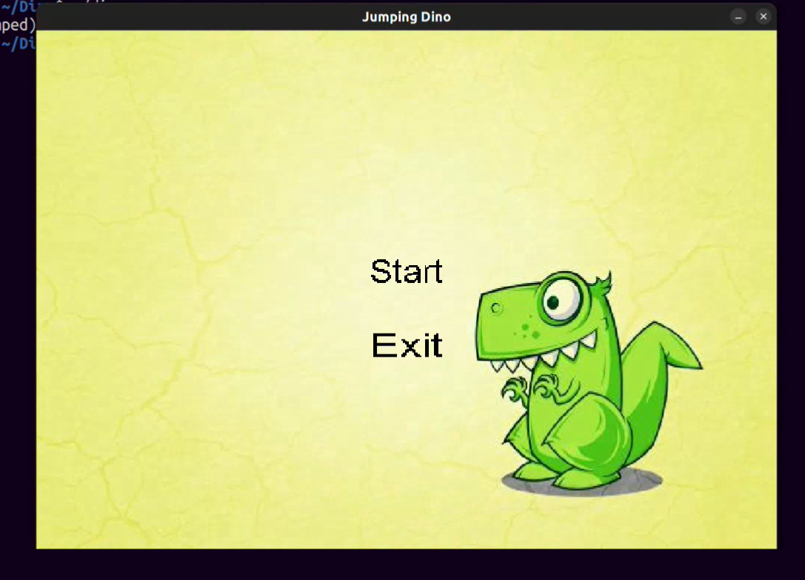

# 🦖 Jumping Dino Project
 
**Developer**: [Mehedi Hasan](https://github.com/hasan-mehedii)

A fun and engaging 2D platformer where players control a dinosaur to avoid ghosts and earn points. This game features smooth animations, dynamic environments, and score tracking.

---

## 📜 About the Project

Jumping Dino is a simple but entertaining game developed using C++ and the SDL2 library. Players navigate a dinosaur through a dynamically changing environment filled with obstacles (ghosts) to achieve the highest score. The game tracks player performance, including the best score and player name, providing a personalized gaming experience.

---
## 🖼️ Screenshots

### Main Menu


### Gameplay


---

## 🎮 Features
- **Dynamic Gameplay:** Avoid incoming ghosts to survive.
- **Jump Mechanics:** Double and multi-jumps for dodging obstacles.
- **Score Tracking:** Keeps track of your current and best scores.
- **Player Name Input:** Customizable player profiles.
- **Persistent Data:** Stores the best scores in a text file.
- **Interactive Background:** Featuring animated grass, trees, clouds, and stones.

---
## 📂 Project Structure  

### Source Files  
- **main.cpp**: Contains the game loop, event handling, and core gameplay logic.  

### Assets  
- **dino.png**: Dinosaur sprite.  
- **ghost.png**: Ghost sprite (obstacles).  
- **tree.png**: Tree for background decoration.  
- **cloud.png**: Cloud for background sky.  

### Data Files  
- **bestscore.txt**: Stores the best score between game sessions.  

---

## 🛠️ Tools, Technologies, and Frameworks Used

- **C++ Programming Language**: Handles core game logic and functionality.
- **SDL2 Library**: Powers graphics and input handling.
  - **SDL2_ttf**: Renders text elements, such as scores and player names.
  - **SDL2_image**: Manages images for game graphics.

---

## 🚀 Getting Started

### Prerequisites
- **C++ Compiler** (e.g., GCC or MSVC)
- **SDL2 Library** installed (along with `SDL2_ttf` and `SDL2_image` if used)

### Running the Game
1. **Clone the repository or download the source code.**
   
    ```bash
    git clone https://github.com/hasan-mehedii/jumping-dino
    cd jumping-dino
2. **Ensure SDL2 is properly installed.**
 
   ```bash
    sudo apt-get install libsdl2-dev libsdl2-image-dev libsdl2-ttf-dev
3. **Compile the project** using your C++ compiler. For example:

   ```bash
   g++ -o JumpingDino game.cpp -lSDL2 -lSDL2_image -lSDL2_ttf  

 4. **Run**

    ```bash
    ./JumpingDino
   
## 📊 Score System
### The game tracks the score based on the number of ghosts avoided:

**Current Score:** Displayed during the game.
**Best Score:** Persistent across sessions, stored in bestscore.txt.   
 
.
## 🎨 Assets & Credits
All graphical assets used in this project were custom-designed or sourced from free resources.

## 📝 Future Improvements
1. Add more obstacles and power-ups.
2. Implement sound effects and background music.
3. Enhance player animations with more dynamic sprite actions.

## 📧 Contact
For any queries or suggestions, feel free to reach out:
[Mehedi Hasan](mailto:mehedi200105075@gmail.com)


